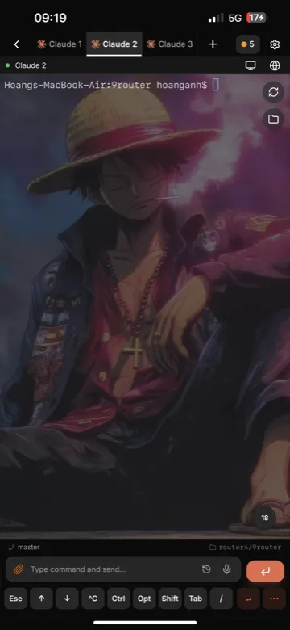
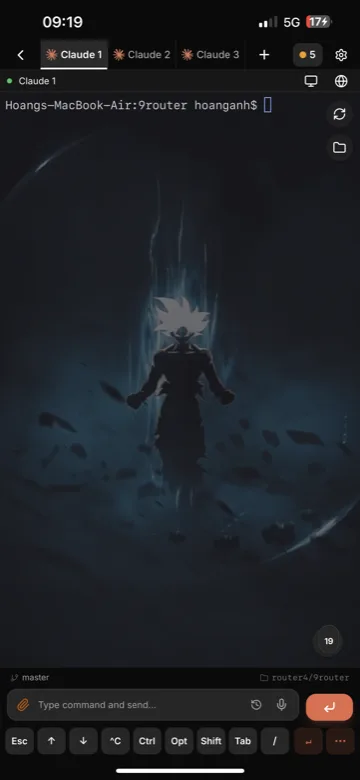
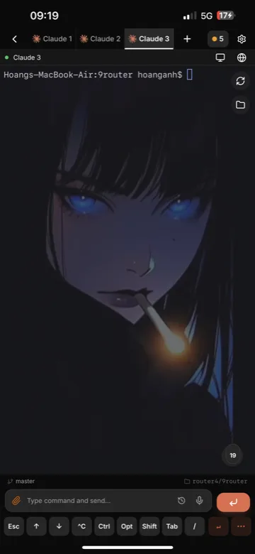
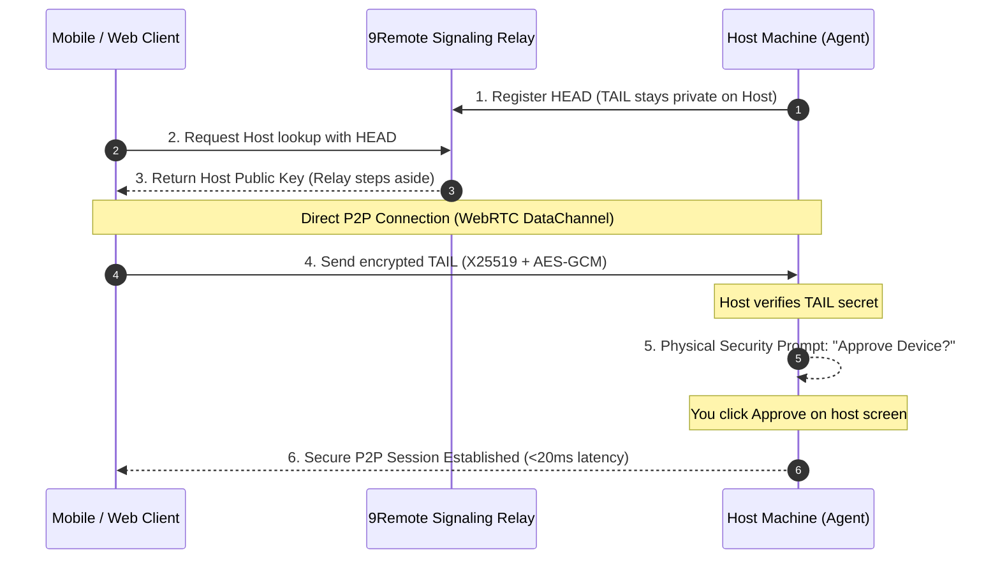

# 9Remote — Remote Everything, Vibecode Everywhere

Your entire dev workstation in your pocket. A remote IDE, 60fps desktop stream, visual file explorer, live mobile emulator, zero-config localhost preview, and remote vibe coding with 30+ AI agents on PC, Web, iPad, or phone.

<div align="center">
  
</div>

### 📱 Mobile Experience

<div align="center">
  
  
  
</div>

---

## ⚡ Quick Start

### 1. Run with npm (Recommended)

```bash
npm i -g 9remote
9remote
```

### 2. Or Download Desktop App

- **macOS (Universal DMG):** [9Remote-macos-universal.dmg](https://github.com/decolua/9remote/releases/latest/download/9Remote-macos-universal.dmg) *(Intel + Apple Silicon, signed & notarized)*
- **Windows (Setup EXE):** [9Remote-windows-x64-setup.exe](https://github.com/decolua/9remote/releases/latest/download/9Remote-windows-x64-setup.exe) *(Installer, x64)*
- **Windows (Portable EXE):** [9Remote.exe](https://github.com/decolua/9remote/releases/latest/download/9Remote.exe) *(Portable, no install)*

Scan the QR code from a phone (or open the URL) and you're on your machine's shell — over WebRTC or WebSocket, through an encrypted tunnel that closes when you stop the agent.

---

## 🖥️ Two Halves. One Session. (Supported Platforms)

| Platform | Host (Agent) | Client (Viewer) | How to Use |
|---|:---:|:---:|---|
| **macOS** | ✅ | ✅ | [Download .dmg](https://github.com/decolua/9remote/releases/latest/download/9Remote-macos-universal.dmg) or `npm i -g 9remote` |
| **Windows** | ✅ | ✅ | [Download .exe](https://github.com/decolua/9remote/releases/latest/download/9Remote-windows-x64-setup.exe) or `npm i -g 9remote` |
| **Linux** | ✅ | ✅ | `npm i -g 9remote` *(Ubuntu, Debian, Fedora, Arch, etc.)* |
| **Web Browser** | — | ✅ | Open [`https://9remote.cc/login`](https://9remote.cc/login) in Chrome, Edge, Safari, Firefox |
| **iOS / iPadOS** | — | ✅ | Safari → [`https://9remote.cc`](https://9remote.cc) → **Share → Add to Home Screen (PWA)** *(iPad trackpad & dev keys supported)* |
| **Android** | — | ✅ | Chrome → [`https://9remote.cc`](https://9remote.cc) → **Install App / Add to Home Screen (PWA)** *(Full-screen dev mode)* |

---

## ✨ 8 Superpowers

1. **Remote Vibe Coding (AI-Ready):** Run Claude Code, Cursor CLI, Aider, Codex & 30+ AI agents with live artifact inspector (HTML, Markdown, Mermaid).
2. **Every Screen, Everywhere:** Seamless across PC, Web, iPad keyboard shortcuts, and mobile touch dev keys (`Esc`, `Tab`, `Ctrl`, `Alt`, arrows).
3. **60fps Remote Desktop:** Ultra-smooth screen streaming with hardware acceleration and <20ms latency over direct WebRTC.
4. **Full Remote IDE:** Multi-pane terminals, integrated code editor with syntax highlighting, visual Git status & diff viewer.
5. **Live Mobile Emulator:** Interactive remote stream for Android Emulator and iOS Simulator straight on your phone.
6. **Zero-Config Localhost Preview:** Built-in Service Worker bridge streams `localhost:3000` to your mobile browser without port forwarding or ngrok.
7. **Visual File Explorer (Path-Jailed):** Fuzzy search files (⌘⇧P), touch drag-and-drop transfers, and file management safely jailed to your workspace.
8. **Persistent PTY Daemon:** Background daemon keeps your shells and long-running builds alive even when switching networks or closing tabs.

---

## 🛡️ Zero-Trust Security Architecture

9Remote uses 3 layers of zero-trust defense:
- **Split-Key Pairing:** The key is split into HEAD and TAIL. The relay server only brokers the handshake with HEAD and never knows your secret TAIL.
- **Direct WebRTC P2P:** Data flows directly device-to-device with X25519 + AES-256-GCM encryption.
- **Physical Host Approval:** New devices cannot connect until you physically click "Approve" on your computer screen.



---

## 📂 What's in here (Monorepo)

- **`agent/`** — the Node.js CLI that runs on the machine you want to reach. Serves PTY terminals (daemonized), streams the screen over WebRTC with dirty-tile diffing, and exposes a jailed file explorer. Published to npm as `9remote`.
- **`web/`** — the Next.js client UI + signaling/session API, deployed to Cloudflare Workers (OpenNext) backed by D1. Terminal data does not flow through it — clients connect to the agent directly.
- **`desktop/`** — Tauri wrapper around the agent for native macOS and Windows desktop apps.
- **`gitbook/`** — the docs site.

The transport protocol (`agent/transport/` and `web/shared/transport/`) is implemented twice, mirrored on both sides — change one, change the other.

---

## 🌐 Self-hosting the web app

The web app runs on Cloudflare Workers and needs a Cloudflare account (the free tier works). Plain-VPS hosting is not supported — the code uses Workers bindings (D1, KV, Durable Objects, R2).

```bash
# 1. Copy the example config and create the resources it references
cp web/wrangler.toml.example web/wrangler.toml
npx wrangler d1 create 9remote
npx wrangler kv namespace create OTA_KV
# fill the printed ids into web/wrangler.toml

# 2. Secrets: copy web/.dev.vars.example → web/.dev.vars, fill in your values,
#    then push them to the Worker
npm run secrets:sync

# 3. Deploy
npm run web:deploy
```

The agent itself runs anywhere Node runs — no Cloudflare dependency.

---

## 📄 License

Business Source License 1.1 — see [LICENSE](LICENSE). In short:

- Use it, build it, modify it, run it for yourself or inside your organization (including at work) — freely, including production.
- Don't offer it (or derivatives) to others as a hosted/managed service, and don't strip its license-key/entitlement/billing mechanism.
- On **2028-08-29** the code automatically becomes Apache-2.0.
