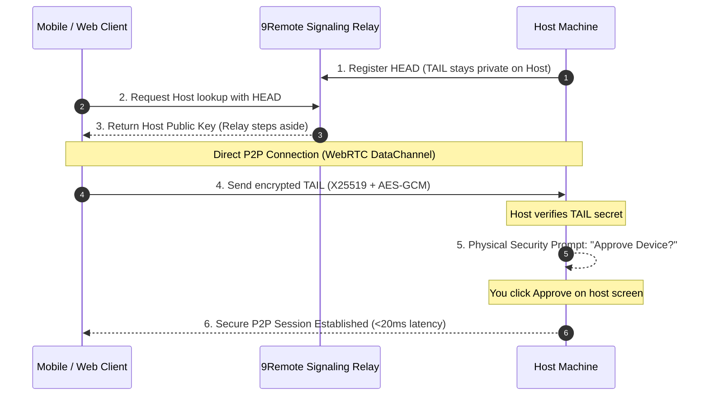

<div align="center">
  <!-- TODO: hero screenshot + phone strip -->


  # 9Remote — Remote Everything, Vibecode Everywhere

  **Bring every dev tool to your phone. Your entire dev workstation in your pocket.**

  Your terminal, IDE, 60fps desktop, files, localhost previews, mobile emulators and every AI coding agent — Claude Code, Codex, Gemini CLI & 30+ more — streamed from your own machine to your phone, tablet or any browser over encrypted WebRTC P2P. No port forwarding, no accounts, no config: install on macOS, Windows or Linux, scan the QR code, and you're in. Sessions survive network switches and locked phones — builds keep running while you walk away.

> **Codex CLI looks like 1995? Claude Code's TUI hurts? Forget them.** Same agents, one UI you'll actually love.

  [](https://www.npmjs.com/package/9remote)
  [](https://www.npmjs.com/package/9remote)
  [](#-license)

  [🚀 Quick Start](#-quick-start) • [📱 Platforms](#-supported-platforms) • [✨ 8 Superpowers](#-8-remote-superpowers) • [🛡️ Security](#-zero-trust-security-architecture) • [📊 Comparison](#-how-9remote-compares) • [🌐 Website](https://9remote.cc) • [📖 Docs](https://docs.9remote.cc)
</div>

---

## ⚡ Quick Start

Start your remote workspace in **30 seconds**:

```bash
npm install -g 9remote
9remote
```

🎉 **Scan the QR code with your phone camera (or open the link on any browser) → click "Approve" on your host → you're in!**

> **Works on macOS, Linux, and Windows.** Requires Node.js 18+.  
> Zero configuration. No port forwarding. No account or signup required.

### CLI Modes

| Command | Mode | Description |
|---------|------|-------------|
| `9remote` | **TUI Mode** | Interactive terminal menu with QR code |
| `9remote ui` | **Web UI Mode** | Opens the host dashboard at `localhost:2208` |

---

## 📱 Supported Platforms

| Platform | Host (Your Machine) | Client (Anywhere) | Download / Access |
|---|:---:|:---:|---|
| **macOS** | ✅ | ✅ | `npm i -g 9remote` or [Download .dmg](https://github.com/decolua/9remote/releases/latest/download/9Remote-macos-universal.dmg) |
| **Windows** | ✅ | ✅ | `npm i -g 9remote` or [Download .exe](https://github.com/decolua/9remote/releases/latest/download/9Remote-windows-x64-setup.exe) |
| **Linux** | ✅ | ✅ | `npm i -g 9remote` |
| **Web Browser** | — | ✅ | [`https://9remote.cc/login`](https://9remote.cc/login) *(Zero install, any browser)* |
| **iOS / iPadOS** | — | ✅ | Web / PWA (Add to Home Screen) *(Supports iPad keyboard & trackpad)* |
| **Android** | — | ✅ | Web / PWA (Add to Home Screen) *(Fullscreen dev mode)* |

---

## ✨ 8 Remote Superpowers

### 🤖 1. Every Harness, One UI (AI-Ready)
- Every AI harness in one UI — run **Claude Code**, Codex, Gemini CLI, Cursor CLI, Aider & 30+ AI agents on the go.
- Built-in artifact inspector with live rendering for HTML, Markdown, and Mermaid diagrams.
- Dedicated AI shortcut triggers and multi-turn workflow tracking.

### 📱 2. Every Screen, Everywhere (Mobile Full Feature)
- Dedicated developer keyboard row (`Esc`, `Tab`, `Ctrl`, `Alt`, navigation arrows).
- Customizable shortcuts and fluid swipe navigation between sessions.
- Tactile haptic feedback on touch for responsive coding.
- Fully adaptive UI: Multi-column IDE on desktop/tablet, touch-first card view on mobile.

### 🖥️ 3. 60fps Remote Desktop (WebRTC P2P)
- Hardware-accelerated screen streaming with ultra-low latency (<20ms).
- Mouse, touch, keyboard controls, and multi-monitor switching.
- Vastly lighter on battery and bandwidth than VNC, AnyDesk, or TeamViewer.

### 💻 4. Full Remote IDE & Multi-pane Terminal
- Multi-pane terminal rows with smooth drag-to-resize splitters.
- Integrated code editor with syntax highlighting and file tree.
- Visual Git status, diff viewer, and multi-worktree switcher.

### 📱 5. Live Remote Emulator
- Interactive remote stream for Android Emulator and iOS Simulator.
- Tap, swipe, and test mobile UI directly from your phone browser without sitting at your desk.

### 🌐 6. Zero-Config Localhost Preview
- Built-in Service Worker bridge streams `localhost:3000` or `localhost:8080` to your mobile browser.
- Preview local web apps in real time with zero port forwarding, no ngrok tunnels, and zero public internet exposure.

### 📁 7. Visual File Explorer (Path-Jailed)
- Visual directory tree with instant fuzzy file search (⌘⇧P).
- Touch drag-and-drop file transfers (upload and download).
- Secured by strict path-jail boundaries keeping your host system safe.

### 🔄 8. Persistent PTY Daemon
- Background daemon keeps your shells and builds alive on the host.
- Switching networks (Wi-Fi to 4G), locking your phone, or closing tabs never kills your running tasks.

---

## 🛡️ Zero-Trust Security Architecture

9Remote uses 3 layers of zero-trust defense:
1. **Split-Key Pairing:** The key is split into HEAD and TAIL. The relay server only brokers the handshake with HEAD and never knows your secret TAIL.
2. **Direct WebRTC P2P:** Data flows directly device-to-device with X25519 + AES-256-GCM encryption.
3. **Physical Host Approval:** New devices cannot connect until you physically click "Approve" on your computer screen.



---

## 📊 How 9Remote Compares

| Feature | **9Remote** | Claude Remote | TeamViewer | Chrome Remote | Termius |
|---------|:-----------:|:-------------:|:----------:|:-------------:|:-------:|
| **Zero Config** | ✅ | ✅ | ✅ | ✅ | ❌ |
| **Remote IDE** | ✅ | ❌ | ❌ | ❌ | ❌ |
| **Every Harness in One UI** | ✅ | ❌ | ❌ | ❌ | ❌ |
| **Terminal Access** | ✅ | ✅ | ❌ | ❌ | ✅ |
| **Persistent Daemon** | ✅ | ✅ | ❌ | ❌ | ✅ |
| **Remote Localhost Preview** | ✅ | ❌ | ❌ | ❌ | ❌ |
| **Touch File Explorer & Editor** | ✅ | ❌ | ✅ | ❌ | ✅ |
| **Remote Desktop (60fps)** | ✅ | ❌ | ✅ | ✅ | ❌ |
| **Remote Emulator** | ✅ | ❌ | ❌ | ❌ | ❌ |
| **AI Agent Artifacts** | ✅ | ✅ | ❌ | ❌ | ❌ |
| **Physical Host Approval** | ✅ | ❌ | ✅ | ❌ | ❌ |
| **Git Integration** | ✅ | ❌ | ❌ | ❌ | ❌ |
| **Mobile & iPad Optimized** | ✅ | ✅ | ❌ | ❌ | ✅ |
| **Browser-Based (Zero Install)** | ✅ | ✅ | ❌ | ✅ | ❌ |
| **QR Login** | ✅ | ✅ | ❌ | ❌ | ❌ |
| **Auto Tunnel** | ✅ | ✅ | ✅ | ✅ | ❌ |
| **No Port Forwarding** | ✅ | ✅ | ✅ | ✅ | ❌ |
| **No Account Required** | ✅ | ❌ | ❌ | ❌ | ❌ |
| **Free & Self-Hostable** | ✅ | ❌ | ❌ | ✅ | ❌ |
| **TOTAL** | **19 / 19** | 9 / 19 | 6 / 19 | 5 / 19 | 5 / 19 |

> **🏆 9Remote: Complete 19/19 capabilities · 100% self-hosted & private.**

---

## 🎯 Use Cases

- **Code from bed** — Fix a bug at 11 PM without getting out of bed. Open your phone, connect to your Mac, fix, commit, push, sleep.
- **Fix bugs at a cafe** — Server alert while having coffee? Connect from your phone or tablet, tail logs, edit configs, and restart services.
- **Deploy on vacation** — Urgent client hotfix while you're away? Phone → 9Remote → `git pull` → build → deploy.
- **Monitor AI Coding Agents** — Run long Claude Code / Cursor tasks on your desktop, and review artifacts, diffs, and progress from your phone.

---

## ❓ FAQ

<details>
<summary><b>🔒 Is 9Remote secure?</b></summary>

**Yes.** 9Remote uses 3 layers of zero-trust defense:
- Outbound-only Cloudflare tunnel (no open ports or firewall changes needed).
- Direct WebRTC peer-to-peer data channels with end-to-end encryption.
- Physical host approval required before any device can access your machine.
- Your code and credentials never touch third-party cloud servers.
</details>

<details>
<summary><b>💰 Is it free?</b></summary>

**Yes.** 9Remote is free for personal, internal, and commercial use inside your organization.
</details>

<details>
<summary><b>🌐 Do I need to open router ports or setup DDNS?</b></summary>

**No.** 9Remote automatically sets up an outbound secure tunnel and negotiates WebRTC P2P connections through NATs and firewalls.
</details>

<details>
<summary><b>🤖 Which AI agents are supported?</b></summary>

Works with any CLI AI tool: **Claude Code**, Codex, Gemini CLI, Cursor CLI, Aider, OpenClaw, and more — every harness, one UI. 9Remote provides dedicated multi-pane terminals and live artifact rendering for HTML and diagrams.
</details>

---

## 📄 License

Apache License 2.0 — see [LICENSE](https://github.com/decolua/9remote/blob/main/LICENSE). Free to use, modify, and distribute, including commercially.
